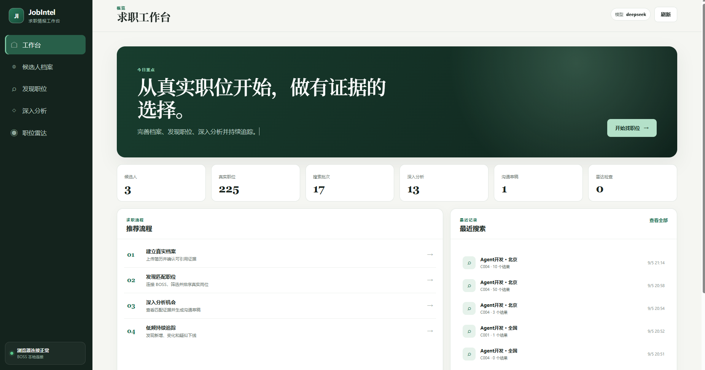
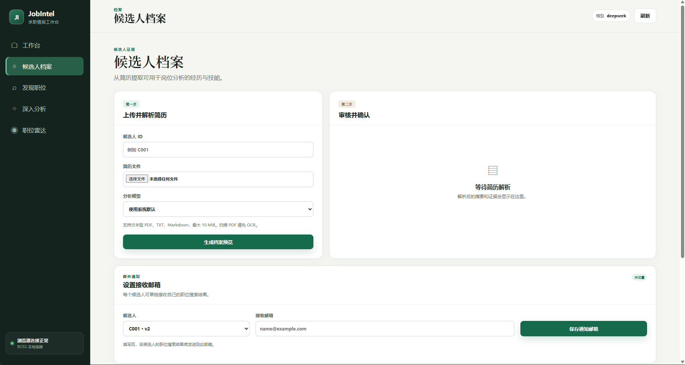
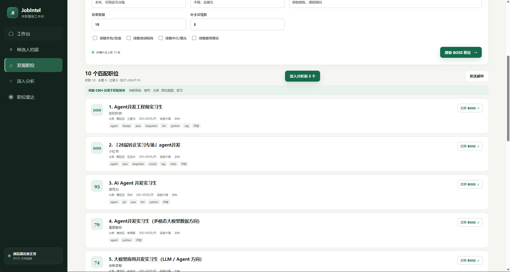
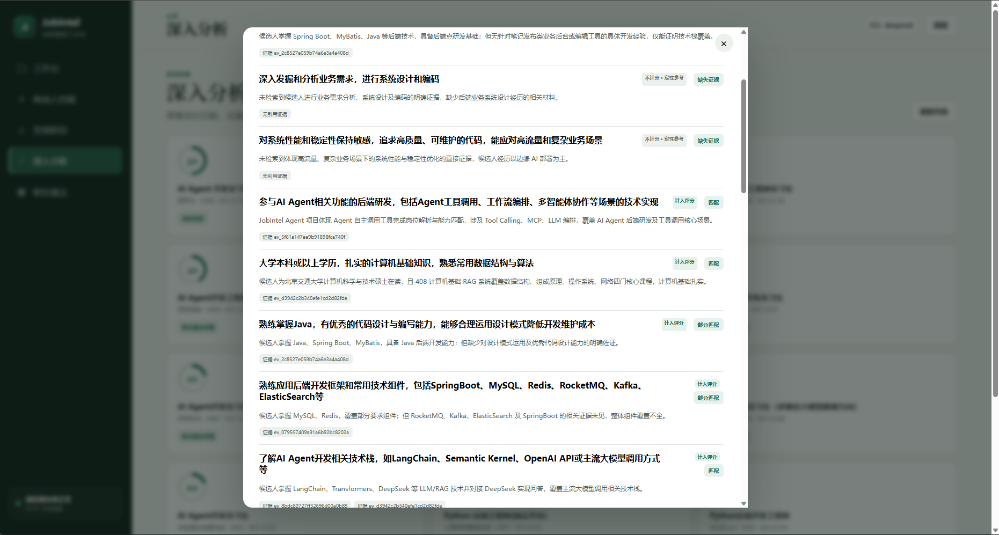

# JobIntel

JobIntel 是一个面向中文求职场景的本地优先智能助手。它把候选人简历、真实职位发现、岗位结构化、匹配分析和持续追踪放在同一套工作流中，并提供 CLI、Web 页面和 FastMCP 三种入口。

当前版本首先支持通过用户自己的 Chrome 会话读取 BOSS 直聘公开展示的职位信息。项目默认采用低频串行请求、随机等待、详情缓存和雷达冷却时间，尽量降低对平台和账号的影响。

## 还在用低效率的方式找工作？

**还在手动搜索岗位，却无法判断自己和岗位到底有多匹配？**

面对几十条相似的招聘信息，你可能还在反复打开页面、逐句对照简历；收藏了很多岗位，却不知道哪些值得优先投递；看到了一个匹配分数，也无法确认它究竟来自真实经历，还是模型的主观猜测。

JobIntel 把这套重复工作变成一条清晰的求职流水线：连接真实职位、建立候选人证据档案、识别岗位硬性要求、生成可解释的匹配分析，并继续完成职位追踪、邮件通知和 HR 沟通准备。

> **让模型理解语义，让规则校验事实，让每一次投递都有依据。**



*从简历、职位发现到深入分析与持续追踪，一套工作台完成核心求职流程。*

> JobIntel 与 BOSS 直聘无隶属或合作关系。使用者应遵守目标平台的服务条款、访问限制和适用法律。请勿用于绕过验证、大规模采集或骚扰招聘者。

## 为什么选择 JobIntel

- **职位真实可追溯**：岗位来自用户自己的 BOSS 登录会话，结果保留原始职位链接，不使用虚构职位填充列表。
- **匹配结果有证据**：模型负责理解简历和 JD，确定性评分与 Evidence Guardrail 负责约束结论，每项能力判断都尽可能回到岗位原文和简历证据。
- **只让硬要求影响分数**：Python、LangChain、RAG、数据库、学历和经验年限等可验证条件参与评分；宽泛职责、团队愿景和难以量化的描述仅作定性参考。
- **为中文求职流程设计**：从岗位筛选、中文分析到 HR 打招呼草稿和邮件通知，不需要在多个工具间反复复制信息。
- **本地优先且由用户掌控**：简历、分析和沟通草稿保存在本地数据库中，发送消息和投递仍由用户最终确认。

### 一份简历，建立可复用的能力证据

上传 PDF、Markdown 或纯文本简历后，JobIntel 会提取经历、项目和技能证据，先生成预览，再由用户确认入库。后续搜索和分析可以持续复用同一份档案，不必为每个岗位重新介绍自己。



### 从真实职位中快速找到值得关注的机会

按关键词、城市、职位类型、薪资和公司规模筛选 BOSS 职位，再根据候选人档案完成本地排序。与其逐页浏览，不如先把精力放在更相关的岗位上。



### 不只告诉你“多少分”，还告诉你“为什么”

深入分析会区分匹配、部分匹配和缺失证据，展示对应的简历引用，并明确哪些要求计入评分。你可以据此决定是否投递、如何修改简历，以及面试前应该补足什么。



## 功能概览

- 导入 PDF、Markdown 或纯文本简历，提取候选人经历与技能证据
- 在确认后保存候选人档案，保留来源和版本信息
- 从 BOSS 关键词搜索和登录首页推荐流发现真实职位，并支持混合采集
- 按保守节奏抓取职位详情，并使用本地缓存减少重复访问
- 使用 Anthropic、OpenAI 或 DeepSeek 分析岗位匹配度
- 输出中文的优势、差距、证据引用、行动建议和推荐等级
- 保存发现批次和分析记录，支持列表查询与重新分析
- 按城市、职位类型、薪资和 BOSS 公司规模筛选职位
- 使用候选人技能、项目/经历证据和教育信息进行可解释排序
- 可选生成最多两个档案相关搜索词，并以串行随机间隔扩展 BOSS 搜索
- 配置职位雷达，按冷却时间检查新的匹配职位
- 提供本地 Web 页面，覆盖主要简历、发现、分析和雷达操作
- 通过 FastMCP 暴露与进程内工具箱一致的工具契约
- 根据岗位分析和简历证据生成中文 HR 打招呼、自我介绍与交流问题
- 保存、编辑和审批沟通草稿，并记录复制、打开岗位和人工已发送事件
- 将已保存搜索批次的职位摘要和原始链接发送到固定通知邮箱

当前不会自动向 HR 发消息，也不会代替用户投递。沟通草稿已接入 CLI 和 Web 分析详情页，见 [`docs/HR_OUTREACH_DESIGN.md`](docs/HR_OUTREACH_DESIGN.md)。

## 快速开始

要求 Python 3.12+、[uv](https://docs.astral.sh/uv/) 和 Chrome/Chromium。

```bash
git clone <your-repository-url>
cd jobintel
cp .env.example .env
uv sync --all-extras
uv run jobintel seed
```

在 `.env` 中填写要使用的模型服务密钥。默认示例使用 DeepSeek：

```dotenv
LLM_PROVIDER=deepseek
DEEPSEEK_API_KEY=your-key
```

启动 Web 页面：

```bash
uv run jobintel web
```

首次打开页面时需要创建管理员账户，密码长度至少为 10 个字符。初始化成功后，公开创建
账户的入口会自动关闭。之后候选人可在登录页自行注册，系统会自动分配不可冲突的候选人
编号和独立数据空间，无需管理员手工创建或填写候选人 ID。

管理员只负责项目治理，可以审核和修改注册用户资料、停用候选人账号、重置候选人密码并配置运行环境。候选人只能访问与
自己账号绑定的档案、搜索批次、分析、邮件设置、职位雷达和沟通草稿；即使直接输入其他
资源 ID，后端也会拒绝访问。历史候选人档案属于业务数据，不会被错误计作注册用户。
用户可以在“账户管理”中修改自己的密码；管理员忘记密码时，可在服务器终端执行：

```bash
uv run jobintel account reset-password 你的用户名
```

角色边界如下：

| 角色 | 可用功能 | 明确禁止 |
|---|---|---|
| 管理员 | 注册用户查询、资料维护、账号启停、密码重置、模型/SMTP/BOSS 连接与访问节奏配置 | 简历档案、职位搜索、岗位分析、雷达、邮件发送和 HR 沟通草稿 |
| 候选人 | 更新自己的账户资料和密码、反复上传简历生成新档案版本、搜索和分析职位、设置自己的通知邮箱、雷达与沟通草稿 | 用户管理、项目环境配置和其他候选人的任何数据 |

管理员在 Web“账户管理”中修改的运行配置保存在本地数据库，并应用于后续业务请求。API
Key 和 SMTP 授权码只显示“已配置/未配置”，不会由接口返回明文；输入框留空表示保留现值。

Web 岗位搜索默认使用“Agent开发 / 北京 / 实习 / 10 个岗位”。公司规模默认不限，
可按 BOSS 披露的 `0-20 人`、`20-99 人`、`100-499 人` 等区间筛选；启用规模筛选时，
未披露规模的职位不会混入结果。

采集模式默认使用“混合发现”，将关键词搜索与 BOSS 登录首页推荐职位合并后去重。推荐流
最多低频读取三轮，不抓取无限滚动内容。每条岗位会标明来自“关键词搜索”还是“首页推荐”，
并根据当前候选人的历史搜索批次标记“首次发现”或“历史已见”。默认优先展示新岗位，也可
选择仅显示此前没有向当前候选人展示过的岗位。

每条搜索结果都会显示实际参与排序的档案版本、命中技能、证据条目，以及目标相关、
档案技能、档案证据、筛选契合和信息质量五项分数。需要扩大候选池时，可以勾选
“根据档案扩展搜索”；该功能默认关闭，开启后最多增加两个串行搜索请求。

默认访问 `http://127.0.0.1:8000`。远程使用优先通过 SSH 转发本地端口。如需监听局域网
地址，应放在 HTTPS 反向代理之后，并使用：

```bash
uv run jobintel web --host 0.0.0.0 --port 8000 --allow-remote
```

HTTPS 部署时请在 `.env` 中设置 `WEB_COOKIE_SECURE=true`，避免登录 Cookie 通过明文连接传输。

在“深入分析”中打开一条分析，即可生成、编辑和批准沟通草稿，并在人工发送后记录状态。

深入分析的数值评分只计算可验证的硬性要求，例如 Python、LangChain、RAG、数据库、框架、明确学历、语言或经验年限。岗位职责、协作方式、产品愿景和难以量化的业务结果仍会展示，但不会参与分数计算。

## 连接 BOSS 直聘

JobIntel 不读取你的日常 Chrome 配置，而是连接一个显式启用远程调试的独立浏览器实例。先退出占用相同调试配置的 Chrome，再运行：

Linux：

```bash
google-chrome --remote-debugging-port=9222 \
  --remote-allow-origins=http://127.0.0.1:9222 \
  --user-data-dir="$HOME/.jobintel/chrome-profile" \
  https://www.zhipin.com/web/user/
```

Windows PowerShell：

```powershell
& "$env:ProgramFiles\Google\Chrome\Application\chrome.exe" `
  --remote-debugging-port=9222 `
  --remote-allow-origins=http://127.0.0.1:9222 `
  --user-data-dir="$env:USERPROFILE\.jobintel\chrome-profile" `
  https://www.zhipin.com/web/user/
```

在打开的浏览器中登录后进行诊断：

```bash
uv run jobintel source-doctor
```

如果 JobIntel 部署在服务器，而 Chrome 运行在本机，可从本机建立反向 SSH 隧道：

```bash
ssh -NT -o ExitOnForwardFailure=yes -o ServerAliveInterval=30 -R 127.0.0.1:9222:127.0.0.1:9222 user@server
```

服务器上的 `9222` 端口必须空闲，并且 SSH 服务端需要允许 TCP 转发。隧道应仅监听 `127.0.0.1`，不要把 Chrome 调试端口暴露到公网。

## 常用 CLI

查看全部入口：

```bash
uv run jobintel --help
```

导入并确认候选人档案：

```bash
uv run jobintel profile import ./resume.pdf --candidate-id C001
uv run jobintel profile show C001
uv run jobintel profile confirm C001
```

发现职位并分析排名靠前的结果：

```bash
uv run jobintel discover \
  --candidate-id C001 \
  --query "Python 后端" \
  --city 上海 \
  --company-size small \
  --smart-expand \
  --salary-min 20 \
  --limit 50 \
  --analyze-top 3
```

查看记录和执行单个岗位分析：

```bash
uv run jobintel discovery list
uv run jobintel analysis list --candidate-id C001
uv run jobintel analyze --candidate-id C001 --job-id J001
```

职位雷达：

```bash
uv run jobintel radar check --candidate-id C001
uv run jobintel radar show --candidate-id C001
```

根据一条已保存的深入分析生成并审核 HR 沟通草稿：

```bash
uv run jobintel outreach generate --analysis-id <分析ID> --tone professional
uv run jobintel outreach show <草稿ID>
uv run jobintel outreach approve <草稿ID>
# 在 BOSS 直聘中人工发送后，再记录结果
uv run jobintel outreach mark-sent <草稿ID>
```

`generate` 只调用 LLM 生成结构化草稿，不访问 BOSS；`approve` 和 `mark-sent` 也只更新本地状态。

发送职位搜索结果邮件：

```bash
uv run jobintel notify discovery <搜索批次ID>
```

SMTP 配置和安全边界见 [`docs/EMAIL_NOTIFICATIONS.md`](docs/EMAIL_NOTIFICATIONS.md)。

启动 MCP 服务：

```bash
uv run jobintel serve-mcp
```

## 配置

完整配置见 [`.env.example`](.env.example)。常用变量包括：

- `LLM_PROVIDER`：`deepseek`、`anthropic` 或 `openai`
- `JOBINTEL_DB_PATH`：本地 SQLite 数据库路径
- `WEB_SESSION_HOURS`：Web 登录会话有效时间
- `WEB_COOKIE_SECURE`：HTTPS 部署时启用 Secure Cookie
- `DISCOVERY_CDP_PORT`：Chrome 调试端口
- `DISCOVERY_*_DELAY_SECONDS`：搜索页和详情页访问间隔
- `DISCOVERY_DETAIL_CACHE_HOURS`：职位详情缓存时间
- `RADAR_MIN_INTERVAL_HOURS`：同一雷达的最短检查间隔
- `AGENT_MAX_*`：模型循环、修复和工具调用上限
- `OUTREACH_MAX_REPAIRS`：沟通草稿结构或证据校验失败后的最大修复次数
- `SMTP_*`：服务器统一使用的 SMTP 发件账号与连接配置；各候选人的接收邮箱在 Web 中设置

`.env`、SQLite 数据库和生成的简历预览均被 Git 忽略。请勿提交 API 密钥、浏览器配置或个人求职数据。

## 开发与打包

```bash
make install
make check
make package
```

`make check` 会运行 Ruff、mypy 严格类型检查和带分支覆盖率门槛的离线测试。`make package` 在检查通过后生成 wheel 和源码包。

项目采用 `src/` 布局，核心模块包括：

```text
src/jobintel/
├── agent/          # 模型循环、提示词和进程内工具箱
├── discovery/      # BOSS/CDP 连接器与发现服务
├── mcp_server/     # FastMCP 适配层
├── outreach/       # HR 沟通草稿、状态机、Prompt 与 Evidence Guardrail
├── persistence/    # SQLite、迁移、仓储和种子数据
├── providers/      # Anthropic/OpenAI/DeepSeek 适配器
├── services/       # 简历、JD、分析、证据和雷达服务
└── web/            # FastAPI 应用与静态前端
```
